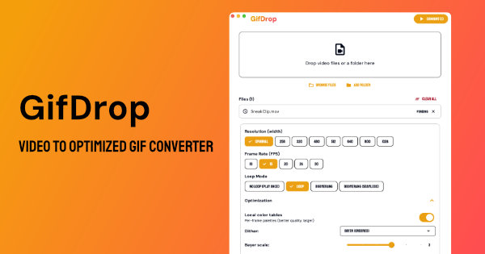

# GifDrop



**GifDrop** is a desktop app that converts video to GIF using **gifski** for high-quality encoding. Drag and drop your files, tweak quality and size, and export—no command line required. It bundles **ffmpeg** (video decoding) and **gifski** (GIF encoding) so you don't need to install anything else.

Built with Flutter for **macOS** (Apple Silicon), **Linux**, and **Windows**.

---

## Download (GitHub Actions)

Pre-built binaries are produced by GitHub Actions on every relevant push (and can be triggered manually).

1. Open your repository on **GitHub**.
2. Go to the **Actions** tab.
3. Select the latest **Build & Package App** run (triggered by push or manual run).
4. Scroll to the **Artifacts** section at the bottom.
5. Download the artifact for your platform:

   | Platform | Artifact name | What you get |
   |----------|----------------|--------------|
   | **macOS (Apple Silicon)** | `app-macos-arm64` | `GifDrop-macos-arm64.zip` → contains `GifDrop.app` |
   | **Linux (x86_64)** | `app-linux-x86_64` | `GifDrop-linux-x86_64.tar.gz` → extract and run the bundle |
   | **Windows (x86_64)** | `app-windows-x86_64` | `GifDrop-windows-x86_64.zip` → extract and run `gif_converter.exe` |

**macOS:** After unzipping, move `GifDrop.app` to Applications (or anywhere). If Gatekeeper blocks it, right‑click → Open once, or remove quarantine:
`xattr -cr /path/to/GifDrop.app`

**Linux:** Extract the tarball and run the executable from inside the bundle (e.g. `./gif_converter` or the path to the runner binary in the bundle).

**Windows:** Extract the zip and run `gif_converter.exe` (or the main executable in the folder).

---

## Features

- **Video → GIF**: Convert video files to high-quality GIF using gifski's advanced color quantization.
- **Quality control**: Adjust overall quality, motion quality, lossy compression, and encoding speed.
- **Drag & drop**: Add files by dropping them on the window or via file picker. Drop a **folder** (or use **Add Folder**) to bulk-add all videos in that folder and its subfolders.
- **Preview**: Preview a selected file before converting.
- **Settings**: Adjust width, FPS, loop mode, quality, and encoding speed.
- **Bundled tools**: ffmpeg and gifski are included; no separate install needed.

---

## Development

### Requirements

- [Flutter](https://docs.flutter.dev/get-started/install) (stable, 3.41.x used in CI)
- [Rust](https://rustup.rs/) (for building gifski from source)
- **macOS**: Xcode, `nasm`, `automake`, `autoconf`, `libtool`, `pkg-config` (e.g. via Homebrew)
- **Linux**: build-essential, GTK, and the usual Flutter/Linux deps; see [BINARIES.md](BINARIES.md) for ffmpeg build deps
- **Windows**: Visual Studio (for Flutter desktop), MSYS2 if building ffmpeg locally

The app expects **ffmpeg** and **gifski** next to the executable (or on `PATH`). For local macOS dev you can use:

```bash
cd macos/Runner/Resources
./fetch_macos_binaries.sh
```

For production builds on all platforms, use the **GitHub Actions workflow** (see [BINARIES.md](BINARIES.md)); it builds ffmpeg and gifski from source and produces the app artifacts above.

### Run locally

```bash
flutter pub get
flutter run -d macos   # or linux / windows
```

### Build release (after placing binaries)

```bash
flutter build macos --release   # or linux / windows
```

Output is under `build/<platform>/...`; the CI workflow injects ffmpeg/gifski and then zips or tarballs the result.

---

## Binaries and licensing

- **ffmpeg** is built as **LGPL** (minimal build, no GPL-only codecs).
- **gifski** CLI is **MIT** licensed.

Details, checksums, and fallback download options: [BINARIES.md](BINARIES.md).

---

## License

This project is licensed under the **GNU General Public License v3.0** (GPL-3.0). See [LICENSE](LICENSE) for the full text.

The app is not published to pub.dev (`publish_to: 'none'`). Bundled tools use their own licenses: **ffmpeg** (LGPL), **gifski** (MIT).
